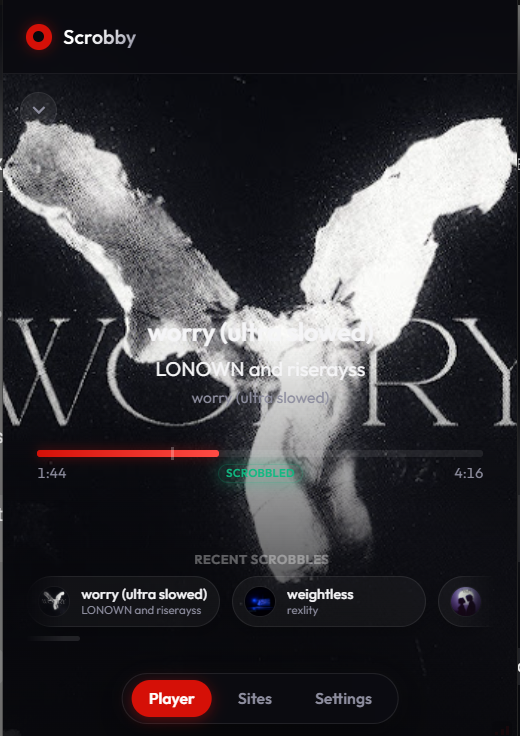
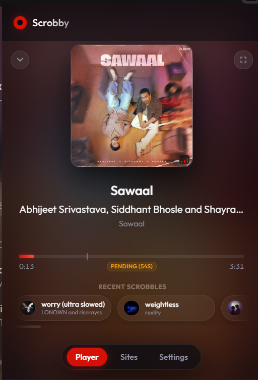
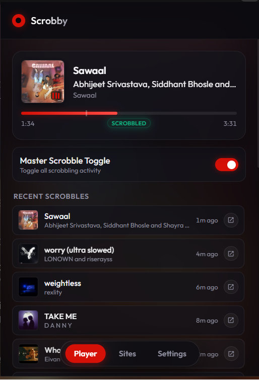
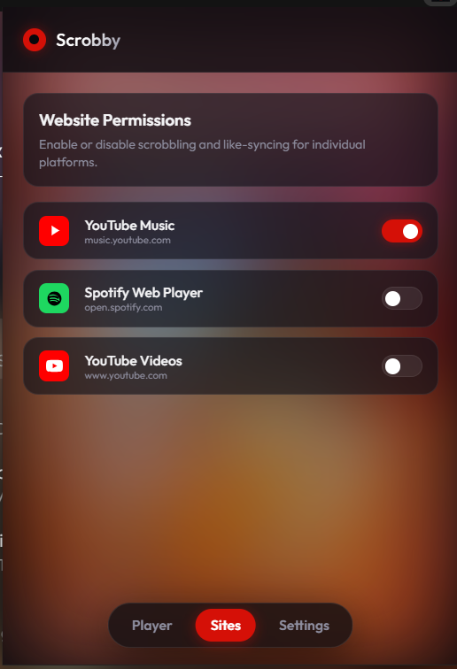
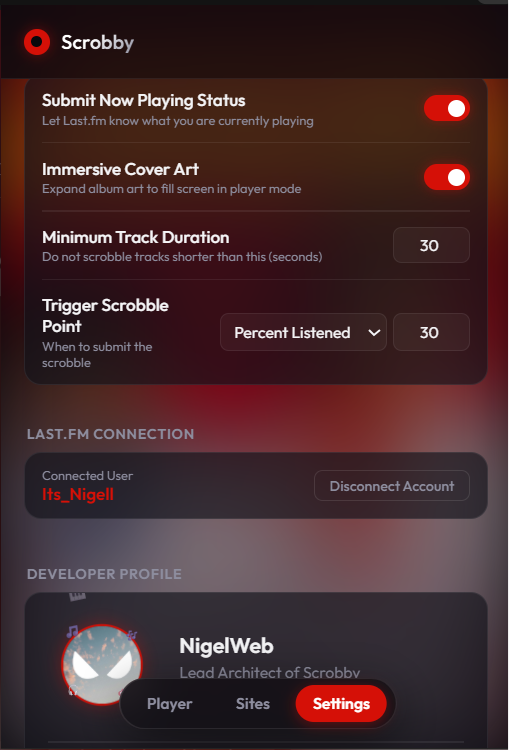

# Scrobby 🎵 - The Ultimate Last.fm Scrobbler

**Scrobby** is a beautiful, premium, and feature-rich browser extension designed for Chromium-based browsers (Chrome, Edge, Brave, Vivaldi) that automatically tracks and scrobbles your music playback from **YouTube Music**, **Spotify Web Player**, and **YouTube Videos** directly to your Last.fm profile.

It features a stunning glassmorphic dark interface, fluid liquid tab transitions, custom progress tracking, real-time liked-to-loved syncing, and an advanced metadata correction pipeline.

---

## 📸 Interface Screenshots

Here are the real screenshots of **Scrobby** in action, showcasing its glassmorphic dark theme and layouts:

| Immersive Fullscreen | Fullscreen Player (Centered) | Mini Player View |
|:---:|:---:|:---:|
|  |  |  |

| Site Permissions Settings | Scrobbling Preferences | Mini Player Scrobbles List |
|:---:|:---:|:---:|
|  |  |  |

---

## ✨ Features

*   **Unified Multi-Site Support**: Track your music seamlessly across:
    *   **YouTube Music** (`music.youtube.com`)
    *   **Spotify Web Player** (`open.spotify.com`)
    *   **YouTube Videos** (`www.youtube.com`)
*   **Zero-Configuration Credentials**: Scrobby comes pre-loaded with built-in default Last.fm API keys (secured with Base64 obfuscation to prevent scanner detection). You can log in directly without setting up anything!
*   **Stunning Immersive Player Mode**: 
    *   Fills the background of the expanded player with sharp cover art.
    *   Applies a soft bottom-up dark gradient overlay to keep text and controls completely readable.
    *   Toggles on-the-fly between immersive fullscreen and centered modes using a small transparent corners button in the top-right of the player header, animating with a liquid morph transition.
*   **Direct Authentication (Zero Redirect)**: Log in directly using your Last.fm username and password inside the extension. Your credentials are sent securely via HTTPS directly to Last.fm and are never saved locally; only a session key is preserved.
*   **Loved Tracks Syncing**: Liking a track on YouTube Music (thumbs up) or Spotify (Heart) instantly registers it as a **Loved Track** on your Last.fm profile. Toggling it off removes the Loved state.
*   **Smart Remix & Video Auto-Correction**:
    *   Strips promotional noise like `[Official Video]`, `(Lyric Video)`, `(Remix)`, etc.
    *   Splits single-line video titles into clean `Artist` and `Track` properties.
    *   Verifies against Last.fm's database; if not found, it triggers a search lookup fallback to match the official track names and caches it locally.
*   **Custom Scrobble Controls**:
    *   Adjust minimum track duration threshold.
    *   Select custom scrobble trigger points (either by percentage of track played or elapsed seconds).
    *   A custom white marker tick shows exactly where on the timeline your scrobble triggers!
*   **Per-Site Permissions**: Toggle scrobbling on/off dynamically site-by-site.
*   **Master Scrobble Switch**: A global pause button to temporarily stop all scrobbling activity.
*   **Fluid Liquid Animations**: Glassmorphic dashboard tabs slide, stretch, and fade smoothly using hardware-accelerated transitions.
*   **Developer Profile panel**: Includes a card dedicated to NigelWeb with a floating circular avatar, flowing music emojis, and an interactive "💡 Click here for a Nigel Fact!" bubble that cycles funny developer facts on click.

---

## 🚀 Installation Guide

Since this is a custom unpacked extension, you can install it manually in less than 1 minute:

1.  **Download or clone** this repository to a folder on your computer.
2.  Open your browser and navigate to the Extensions page:
    *   **Chrome**: `chrome://extensions`
    *   **Brave**: `brave://extensions`
    *   **Edge**: `edge://extensions`
3.  Turn **ON** **Developer mode** (toggle in the top-right corner).
4.  Click the **Load unpacked** button (top-left corner).
5.  Select the folder containing this extension (the folder containing `manifest.json`).
6.  Pin **Scrobby** to your toolbar for quick access!

---

## 🔑 Setup & Authentication

1.  **Zero-Config Login (Recommended)**:
    *   Open the extension popup.
    *   Input your **Last.fm Username & Password** in the Direct Login tab and click **Log In Directly**.
    *   You are fully connected!
2.  **Advanced API Keys (Optional)**:
    *   If you wish to use your own custom developer key instead of Scrobby's built-in defaults:
    *   Go to [Last.fm's Create API Account](https://www.last.fm/api/account/create) (takes 30 seconds).
    *   Copy your unique **API Key** and **Shared Secret**.
    *   Open Scrobby, expand the **Advanced API Key Setup** folder in the login screen.
    *   Paste your credentials, click **Save API Credentials**, and log in.

---

## 🛠️ Technology Stack

*   **Manifest V3**: Modern browser extension standard.
*   **Vanilla HTML5/CSS3/JavaScript**: Fast, lightweight, and zero external framework dependencies.
*   **Media Session API Interceptor**: Injects into the page `MAIN` world to intercept media metadata streams directly.
*   **CSS Mask Scroll Fading**: Blurs out overflowing horizontal pills for a clean scroll boundary.
*   **Base64 Obfuscation**: Shields default keys from automated crawler search engines.
