# Scrobby 🎵 - The Ultimate Last.fm Scrobbler

[]()
[]()
[](https://www.gnu.org/licenses/gpl-3.0)

**Scrobby** is a beautiful, premium, and feature-rich browser extension designed for Chromium-based browsers (Chrome, Edge, Brave, Vivaldi) that automatically tracks and scrobbles your music playback from **YouTube Music**, **Spotify Web Player**, and **YouTube Videos** directly to your Last.fm profile.

It features a stunning glassmorphic dark interface, fluid liquid tab transitions, custom progress tracking, real-time liked-to-loved syncing, and an advanced metadata correction pipeline.

---

## 📸 Interface Screenshots

Here are the interface screenshots of **Scrobby** in action, showcasing its glassmorphic dark theme and layouts:

| Immersive Mode (Mouse Active) | Immersive Mode (Idle Screensaver) | Fullscreen Player (Layout 1) | Fullscreen Player (Layout 2) |
|:---:|:---:|:---:|:---:|
| 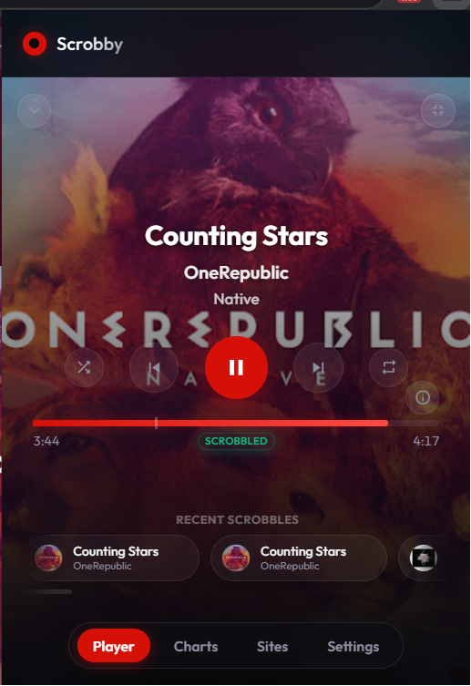 | 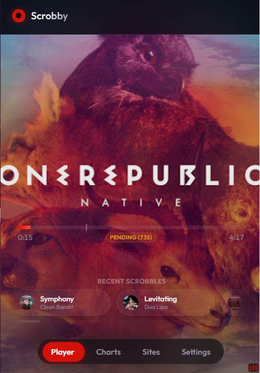 | 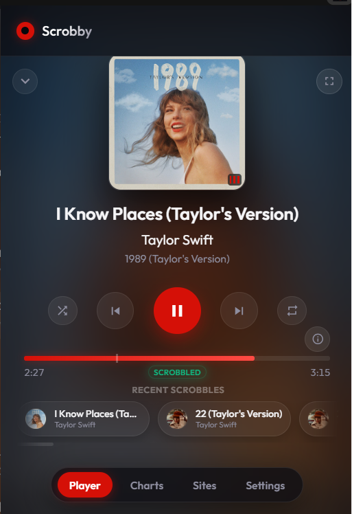 | 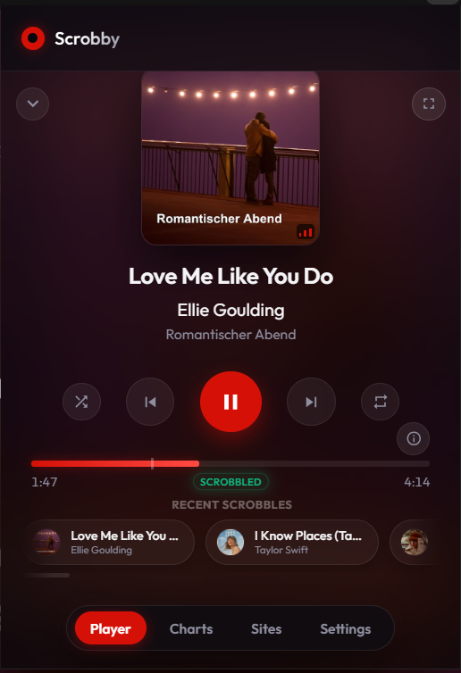 |

| Mini Player View | Site Permissions Settings | Scrobbling Preferences / Settings |
|:---:|:---:|:---:|
| 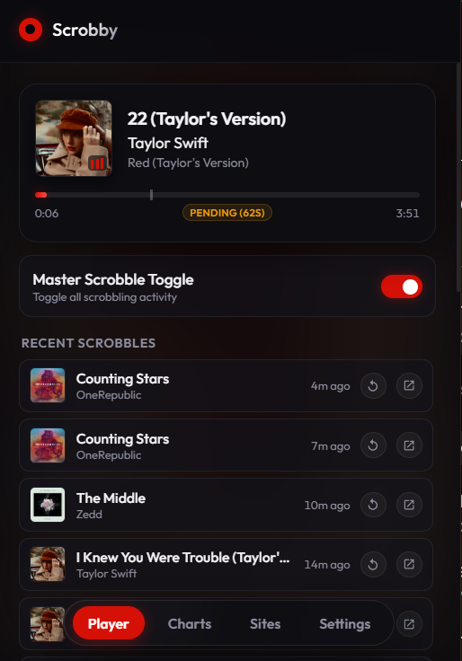 | 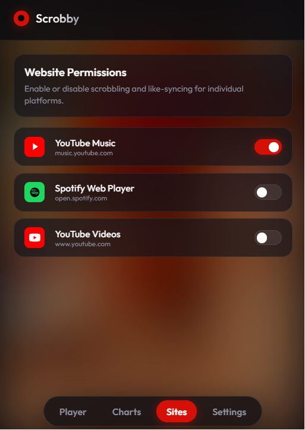 | 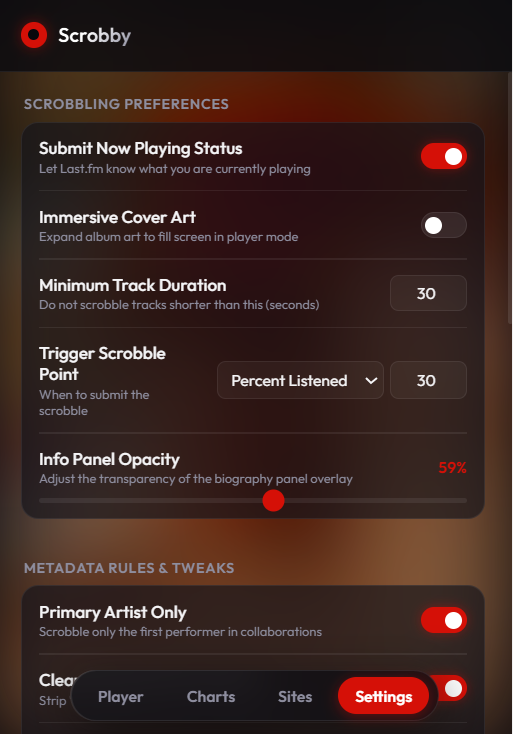 |

| Local Listening Charts | Recent Scrobbles List |
|:---:|:---:|
| 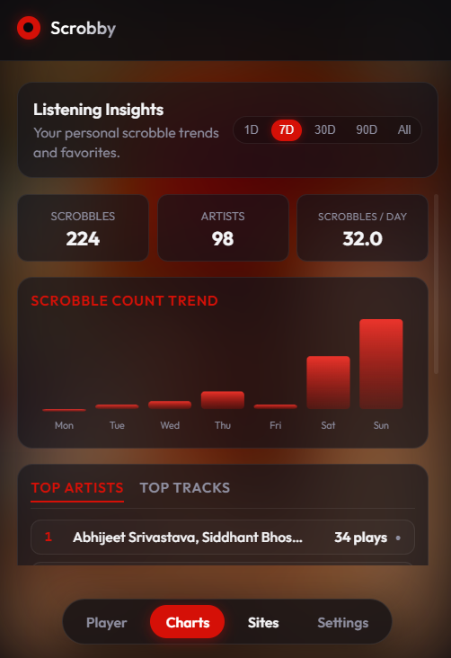 | 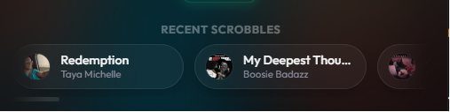 |

---

## 🎥 Visual Demonstrations

Here is a side-by-side comparison of the high-fidelity demonstration screens (centered player layouts vs. the active/idle states of the fluid immersive background player):

| Centered Player (Demo 1) | Centered Player (Demo 2) | Immersive Player (Active Mouse) | Immersive Player (Idle Screensaver) |
|:---:|:---:|:---:|:---:|
| 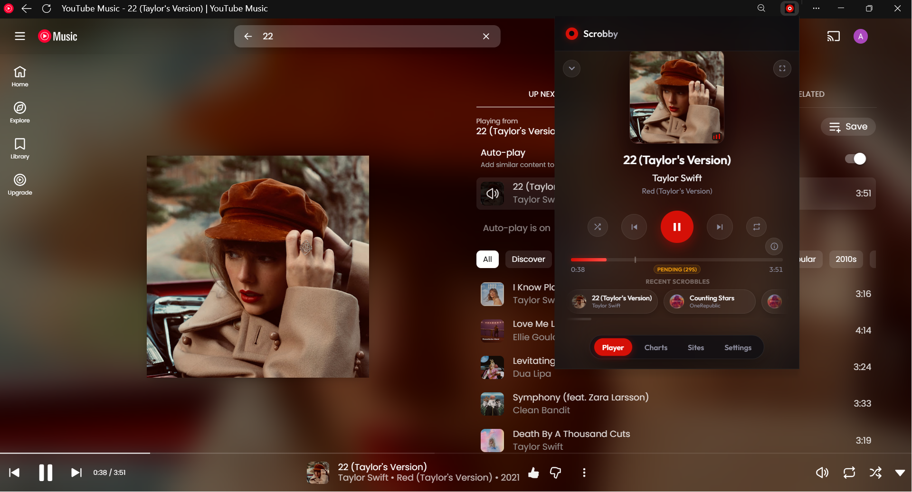 | 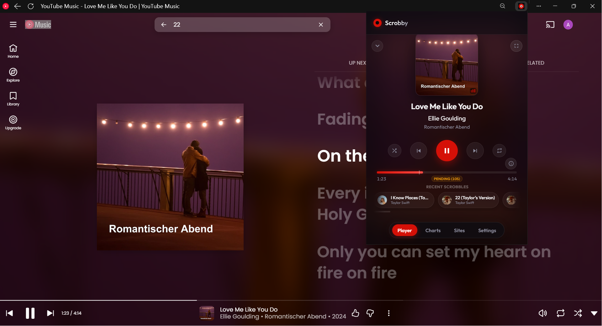 | 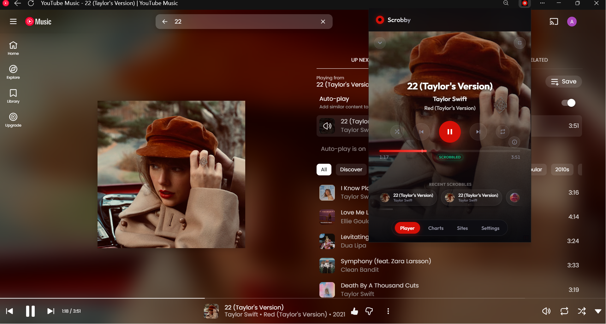 | 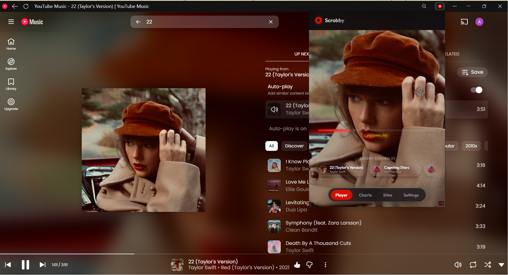 |

---

## ✨ Features

*   **Unified Multi-Site Support**: Track your music seamlessly across:
    *   **YouTube Music** (`music.youtube.com`)
    *   **Spotify Web Player** (`open.spotify.com`)
    *   **YouTube Videos** (`www.youtube.com`)
*   **Zero-Configuration Credentials**: Scrobby comes pre-loaded with built-in default Last.fm API keys (secured with Base64 obfuscation to prevent scanner detection). Log in directly without setting up developer keys!
*   **Universal Media Controls**: Play, Pause, Skip Next, Skip Previous, Shuffle, and Repeat your music on Spotify, YouTube Music, and YouTube directly from the extension interface!
*   **Active Shuffle & Repeat Indicators**: 
    *   **Shuffle**: Glows in signature Last.fm Red when active.
    *   **Repeat Playlist**: Glows in Spotify Green when repeat-all is enabled.
    *   **Repeat Track**: Glows in Last.fm Red with a tiny, bold circular **"1" badge** in the corner.
*   **Recent Scrobbles Replay Button**: Click the counter-clockwise replay arrow next to any scrobbled track to instantly load and replay that exact track in your active music player tab.
*   **Scroll-based Mode Switcher**: Scroll up/down on the player card to switch smoothly between **Mini Player (Collapsed)** ➔ **Normal Expanded Card** ➔ **Immersive Mode** (with built-in scroll delta threshold filtering to prevent accidental triggers).
*   **Hover-Out Idle Screensaver Mode**: When your mouse leaves the popup window in Immersive Mode, the track metadata and controls slide out and fade away completely, leaving a clean, beautiful view of the cover art with just the progress bar at the bottom.
*   **Stunning Immersive Player Mode**: 
    *   Fills the background of the expanded player with sharp cover art.
    *   Applies a soft bottom-up dark gradient overlay to keep text and controls completely readable.
    *   Toggles on-the-fly between immersive fullscreen and centered modes using a small transparent corners button in the top-right of the player header, animating with a liquid morph transition.
*   **Direct Authentication (Zero Redirect)**: Log in directly using your Last.fm username and password inside the extension. Your credentials are sent securely via HTTPS directly to Last.fm and are never saved locally; only a session key is preserved.
*   **Loved Tracks Syncing**: Liking a track on YouTube Music (thumbs up) or Spotify (Heart) instantly registers it as a **Loved Track** on your Last.fm profile. Toggling it off removes the Loved state.
*   **Smart Remix & Video Auto-Correction**:
    *   Strips promotional noise like `[Official Video]`, `(Lyric Video)`, `(Remix)`, etc.
    *   Splits single-line video titles into clean `Artist` and `Track` properties.
    *   Verifies against Last.fm's database; if not found, it triggers a search lookup fallback to match the official track names and caches it locally.
*   **Custom Scrobble Controls**:
    *   Adjust minimum track duration threshold.
    *   Select custom scrobble trigger points (either by percentage of track played or elapsed seconds).
    *   A custom white marker tick shows exactly where on the timeline your scrobble triggers!
*   **Per-Site Permissions**: Toggle scrobbling on/off dynamically site-by-site.
*   **Master Scrobble Switch**: A global pause button to temporarily stop all scrobbling activity.
*   **Fluid Liquid Animations**: Glassmorphic dashboard tabs slide, stretch, and fade smoothly using hardware-accelerated transitions.
*   **Developer Profile Panel**: Includes a card dedicated to NigelWeb with a floating circular avatar, flowing music emojis, and an interactive "💡 Click here for a Nigel Fact!" bubble that cycles funny developer facts on click.

---

## 🚀 Easy Installation Guide (via GitHub)

Since this is a custom unpacked extension, you can install it manually in less than 1 minute:

### Method A: Download Repository Zip (Easiest)
1. Click the green **Code** button at the top of this repository and select **Download ZIP** (or download the packaged extension `.zip` from our Releases page).
2. Extract the downloaded `.zip` file into a folder on your computer.

### Method B: Git Clone
1. Clone the repository directly to your machine:
   ```bash
   git clone https://github.com/code4nigel/Scrobby---The-LastFM-Scrobbler-Extension-.git
   ```

### Loading Unpacked Into Your Browser
1. Open your browser and navigate to the Extensions page:
    *   **Chrome**: `chrome://extensions`
    *   **Brave**: `brave://extensions`
    *   **Edge**: `edge://extensions`
2. Turn **ON** **Developer mode** (toggle in the top-right corner).
3. Click the **Load unpacked** button (top-left corner).
4. Select the extracted folder containing this extension (the folder containing `manifest.json`).
5. Pin **Scrobby** to your toolbar for quick access!

---

## 🔑 Setup & Authentication

1.  **Zero-Config Login (Recommended)**:
    *   Open the extension popup.
    *   Input your **Last.fm Username & Password** in the Direct Login tab and click **Log In Directly**.
    *   You are fully connected!
2.  **Advanced API Keys (Optional)**:
    *   If you wish to use your own custom developer key instead of Scrobby's built-in defaults:
    *   Go to [Last.fm's Create API Account](https://www.last.fm/api/account/create) (takes 30 seconds).
    *   Copy your unique **API Key** and **Shared Secret**.
    *   Open Scrobby, expand the **Advanced API Key Setup** folder in the login screen.
    *   Paste your credentials, click **Save API Credentials**, and log in.

---

## 🛠️ Technology Stack

*   **Manifest V3**: Modern browser extension standard.
*   **Vanilla HTML5/CSS3/JavaScript**: Fast, lightweight, and zero external framework dependencies.
*   **Media Session API Interceptor**: Injects into the page `MAIN` world to intercept media metadata streams directly.
*   **CSS Mask Scroll Fading**: Blurs out overflowing horizontal pills for a clean scroll boundary.
*   **Base64 Obfuscation**: Shields default keys from automated crawler search engines.

---

## 🙋 Needing Help & Testing Status

> [!IMPORTANT]
> **Active Testing Status**:
> * **YouTube Music (`music.youtube.com`)**: Fully tested, validated, and actively used. All features (media controls, loved tracks, scrobbling, seek, shuffle/repeat indicators) are guaranteed to work smoothly.
> * **Spotify Web Player (`open.spotify.com`) & YouTube Videos (`www.youtube.com`)**: These sites are configured and fully integrated into our tracking logic, but they have **not been tested directly** in everyday scenarios. You may encounter bugs, layout quirks, or missing controls on these platforms.

If you encounter any issues, bugs, or have suggestions for improvements:
1. Open an issue on our [GitHub Issues](https://github.com/code4nigel/Scrobby---The-LastFM-Scrobbler-Extension-/issues) page.
2. Provide details about your browser, which music site you were using, and any console error logs (right-click popup -> Inspect -> Console).
3. Pull Requests are highly welcome if you'd like to help test and fix issues on Spotify or YouTube!
